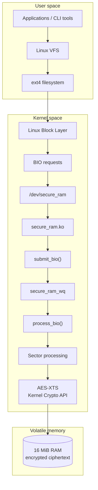
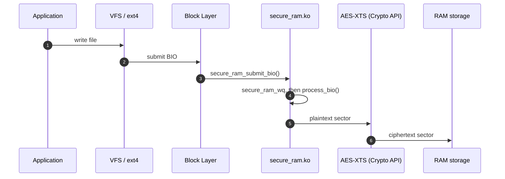
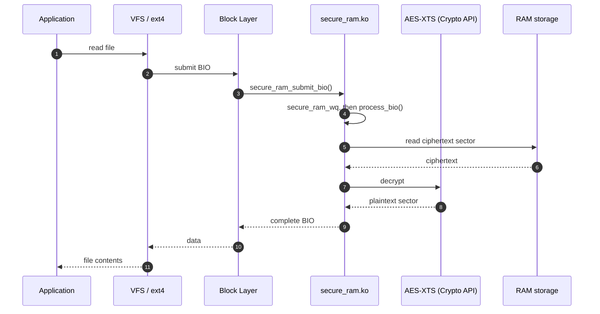
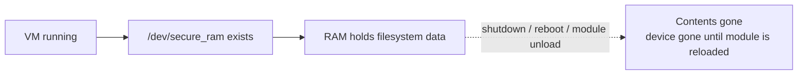

<div align="center">

# Encrypted Virtual RAM Disk Block Driver

**A Linux kernel-space virtual block device that provides temporary, RAM-backed storage with transparent AES-XTS encryption.**

<br>


<br>

[Overview](#overview) &nbsp;·&nbsp;
[Quick Start](#quick-start) &nbsp;·&nbsp;
[Architecture](#architecture) &nbsp;·&nbsp;
[Testing](#testing) &nbsp;·&nbsp;
[Performance](#performance) &nbsp;·&nbsp;
[Security](#security-considerations)

</div>

---

## Overview

Traditional storage devices keep their contents on persistent media such as SSDs or HDDs. A RAM disk takes the opposite approach and uses volatile system memory as storage.

This project extends that idea by building an **encrypted RAM-backed block device inside the Linux kernel**. The driver exposes a 16 MiB virtual disk as `/dev/secure_ram`. Block data is encrypted with AES-256-XTS *before* it is written into the RAM-backed buffer, and decrypted on the way back out.

Linux treats the region of RAM as a normal block device, so you can format it with a standard filesystem such as ext4, mount it, and use it with ordinary file operations, without applications ever handling encryption themselves.

### At a Glance

| | |
|---|---|
| **Device node** | `/dev/secure_ram` |
| **Capacity** | 16 MiB |
| **Backing store** | System RAM (volatile) |
| **Cipher** | AES-256-XTS through the Linux Kernel Crypto API (`xts(aes)`) |
| **Key** | 64-byte key, generated in kernel space at module init and cleared on unload |
| **I/O model** | BIO-based, processed through the `secure_ram_wq` workqueue |
| **Filesystem** | ext4 |
| **Debug interface** | Read-only debugfs: `/sys/kernel/debug/secure_ram/raw_storage` |

### Objectives

- Implement a custom Linux kernel module
- Create a RAM-backed virtual block device and expose it as `/dev/secure_ram`
- Support block-level read and write operations
- Allow a standard Linux filesystem such as ext4 to operate on the device
- Integrate the Linux Kernel Crypto API and use AES-256-XTS for transparent block encryption and decryption
- Keep encrypted data in the RAM-backed storage area
- Validate correctness using file-integrity and round-trip tests
- Measure the performance of the encrypted RAM disk against the VM's conventional filesystem

---

## Key Features

| Feature | Details |
|---|---|
| **RAM-backed storage** | 16 MiB of kernel-managed RAM. Volatile by design and not intended for persistent data. |
| **Linux block device** | Registers as `/dev/secure_ram` and works with normal block-device mechanisms. |
| **ext4 support** | Format with `mkfs.ext4`, mount like any other disk. |
| **Transparent encryption** | Applications never call encryption or decryption routines. The driver handles it inside the storage path. |
| **AES-256-XTS** | Uses the kernel's own `xts(aes)` implementation with a 64-byte key. No hand-rolled AES. |
| **Ephemeral key** | Generated in kernel space at initialization, cleared when the module is unloaded. |
| **Ciphertext verification** | A read-only debugfs file exposes the raw backing buffer so you can confirm that only ciphertext is stored. |

---

## Architecture



### Write Path

When an application writes a file, plaintext travels down through the filesystem and block layer, is encrypted sector by sector, and lands in RAM as ciphertext.



### Read Path

For reads, the process runs in the opposite direction. Ciphertext is decrypted before the data is returned to the filesystem.



---

## Quick Start

### Requirements

A Linux development environment with GCC, Make, matching kernel headers, kmod and Git.

On Ubuntu:

```bash
sudo apt update
sudo apt install build-essential linux-headers-$(uname -r) kmod git
```

### 1. Clone and build

```bash
git clone https://github.com/943ak/Encrypted-Virtual-RAM-Disk-Block-Driver.git
cd Encrypted-Virtual-RAM-Disk-Block-Driver
make
```

This produces the kernel module `secure_ram.ko`.

### 2. Load the driver

```bash
sudo insmod ./secure_ram.ko
```

Verify that it loaded and that the device exists:

```bash
lsmod | grep secure_ram
sudo dmesg | tail -n 20
ls -l /dev/secure_ram
lsblk
```

### 3. Create an ext4 filesystem and mount it

```bash
sudo mkfs.ext4 /dev/secure_ram
sudo mkdir -p /mnt
sudo mount /dev/secure_ram /mnt
```

### 4. Use it

```bash
echo "Hello from the encrypted RAM disk" | sudo tee /mnt/test.txt
cat /mnt/test.txt
```

### 5. Clean up

```bash
sudo umount /mnt
sudo rmmod secure_ram
```

> [!NOTE]
> Unloading the module destroys the RAM-backed storage **and** the encryption key. Reloading the driver generates a new key, so previous contents cannot be recovered.

---

## Encryption Verification

The encryption was verified using a known plaintext and direct inspection of the RAM-backed storage.

**Test plaintext:**

```
CAPSTONE_SECRET_123456789
```

Reading through the normal device interface returns the original plaintext after transparent decryption. The raw backing storage, however, holds ciphertext. During development, the backing buffer can be inspected through debugfs:

```bash
sudo dd if=/sys/kernel/debug/secure_ram/raw_storage bs=512 count=1 status=none | xxd
```

The plaintext does not appear in the backing storage, while the matching read through `/dev/secure_ram` returns it intact.

| View | What you see |
|---|---|
| **Application** | `CAPSTONE_SECRET_123456789` |
| **RAM** | Encrypted ciphertext |

---

## Testing

| Test | Method | Validates |
|---|---|---|
| **Raw block read/write** | A known string is written directly to the block device and read back | Write goes to encrypted storage, read returns the decrypted original |
| **ext4 filesystem** | Format with ext4, mount, create, read, copy and remove files | The driver works under a real filesystem |
| **Large file round trip** | A 4 MiB random binary file is written to the RAM filesystem, copied back, and compared with SHA-256 | Source and recovered files produced **identical SHA-256 hashes** |
| **Sector boundary** | Data sizes around sector boundaries (listed below) | Correct handling of requests that cross sector boundaries |
| **Ciphertext inspection** | The backing buffer is read through debugfs | Stored data is ciphertext, not the known plaintext |

<details>
<summary><b>Sector boundary test sizes</b></summary>

<br>

| Around 512 B | Around 1 KiB | Around 4 KiB |
|---|---|---|
| 511 bytes | 1023 bytes | 4095 bytes |
| 512 bytes | 1024 bytes | 4096 bytes |
| 513 bytes | 1025 bytes | 4097 bytes |

</details>

---

## Performance

The encrypted RAM disk was benchmarked against the conventional filesystem inside the development VM using [`fio`](https://github.com/axboe/fio).

| Workload | Conventional VM filesystem | Encrypted RAM disk |
|---|---:|---:|
| **Sequential write** | ~22.2 MiB/s | **~190 MiB/s** |
| **Sequential read** | ~29.2 MiB/s | **~250 MiB/s** |

> [!NOTE]
> These numbers are specific to the development VM and benchmark configuration. They are **not** universal hardware-performance results, and results depend heavily on the host machine, VM configuration and workload. The encrypted RAM disk achieved substantially higher throughput in the tested workload, even though encryption adds extra CPU work.

---

## Data Volatility

The storage is intentionally volatile. RAM is the backing store, not persistent media.



The project source code and compiled module stored on the VM's persistent virtual disk remain available.

---

## Security Considerations

The encryption subsystem protects the **confidentiality** of data stored in the RAM-backed block storage. The project uses AES-XTS through the Linux Kernel Crypto API instead of implementing AES manually.

> [!WARNING]
> This is an **academic prototype**, not production-grade encrypted storage.

Important limitations:

- The encryption key is **ephemeral** and exists only while the driver is active.
- Reloading the driver generates a new key, so existing encrypted contents cannot be recovered once the key is destroyed.
- AES-XTS provides confidentiality but **does not provide authentication or integrity protection** against ciphertext modification.
- The project does not claim to encrypt every copy of a file that may exist elsewhere in system memory, caches or application memory.
- Key management is intentionally simplified for the capstone implementation.

---

## Advantages and Limitations

<table>
<tr>
<td valign="top" width="50%">

###            Advantages

- Very low storage latency compared with the tested VM filesystem
- Temporary storage that does not persist across shutdown
- Transparent integration with Linux filesystem operations
- Encryption is handled inside the storage path
- Demonstrates kernel programming, block I/O, filesystem integration and cryptography in one project

</td>
<td valign="top" width="50%">

###            Limitations

- Capacity is currently limited to 16 MiB, can be increased as per future needs
- Data is lost when the RAM-backed storage is destroyed
- A prototype, not a replacement for mature storage-encryption systems
- Key management is simplified
- XTS does not provide authenticated integrity
- Performance depends heavily on host, VM configuration and workload

</td>
</tr>
</table>

---

## Roadmap

- [.] Configurable RAM-disk size
- [.] Improved key management
- [.] User-configurable keys supplied through a secure interface
- [.] Encryption-key rotation
- [.] Integrity / authentication mechanisms
- [.] Additional block-device statistics
- [.] More sophisticated concurrency and queue management
- [.] Configurable sector / block sizes
- [.] Automated test suites
- [.] Extended benchmarking across multiple workloads
- [.] Support for additional filesystem configurations

---
<!--  -->
<!-- ## Project Status -->
<!--  -->
<!-- | Component | Status | -->
<!-- |---|:---:| -->
<!-- | Kernel module | ✅ | -->
<!-- | RAM-backed storage | ✅ | -->
<!-- | Virtual block device | ✅ | -->
<!-- | `/dev/secure_ram` | ✅ | -->
<!-- | BIO-based read/write handling | ✅ | -->
<!-- | ext4 filesystem integration | ✅ | -->
<!-- | AES-XTS encryption | ✅ | -->
<!-- | Transparent decryption | ✅ | -->
<!-- | Ciphertext verification | ✅ | -->
<!-- | Large-file integrity testing | ✅ | -->
<!-- | Performance benchmarking | ✅ | -->
<!-- | Documentation | 🔄 | -->
<!--  -->
<!-- --- -->
<!--  -->
<!-- ## Repository Structure -->
<!--  -->
<!-- ``` -->
<!-- Encrypted-Virtual-RAM-Disk-Block-Driver/ -->
<!-- │ -->
<!-- ├── secure_ram.c        # Kernel module source -->
<!-- ├── Makefile            # kbuild build rules -->
<!-- ├── .gitignore          # Excludes generated kernel build artifacts -->
<!-- ├── README.md -->
<!-- │ -->
<!-- ├── docs/ -->
<!-- │   └── architecture/ -->
<!-- │ -->
<!-- ├── tests/ -->
<!-- ├── results/ -->
<!-- └── screenshots/ -->
<!-- ``` -->
<!--  -->
<!-- --- -->

## Technologies Used

| Area | Technologies |
|---|---|
| **Programming** | C, Linux Kernel APIs |
| **Kernel / Storage** | Linux kernel module, Linux block layer, BIO-based block I/O, `gendisk`, `block_device_operations`, kernel workqueue, kernel memory allocation, debugfs |
| **Filesystem** | ext4 |
| **Cryptography** | Linux Kernel Crypto API, AES-256-XTS |
| **Build system** | Linux kbuild, Make, GCC |
| **Environment** | Ubuntu Linux, virtual machine, SSH, Git / GitHub |

---

## Disclaimer

This project was developed as an academic Linux systems and storage capstone. It demonstrates the principles of:

- Linux kernel module development
- Virtual block devices
- RAM-backed storage
- Filesystem integration
- Transparent storage encryption
- Kernel cryptographic APIs
- Storage benchmarking

It should not be considered a production replacement for established Linux storage-encryption solutions.

---

<div align="center">

**Author**

Abhijeet Kumar Kuila &nbsp;·&nbsp; [@943ak](https://github.com/943ak)

</div>
